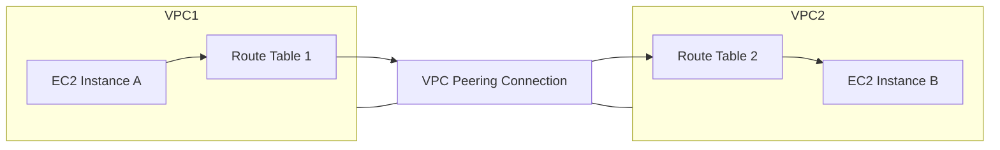

# 1. There are two VPCs, and I want to privately communicate with one EC2 from another VPC?

#### Here are the key methods to establish private communication between EC2 instances in different VPCs:
1. Create VPC peering connection between VPCs
2. Accept peering connection in destination VPC
3. Update route tables in both VPCs to route traffic through peering connection
4. Configure security groups to allow required traffic

**Alternative solutions:**
- Transit Gateway (for connecting multiple VPCs)
- VPN Connection (if VPCs are in different regions)
- PrivateLink (for specific service access)

