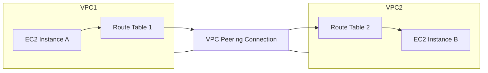
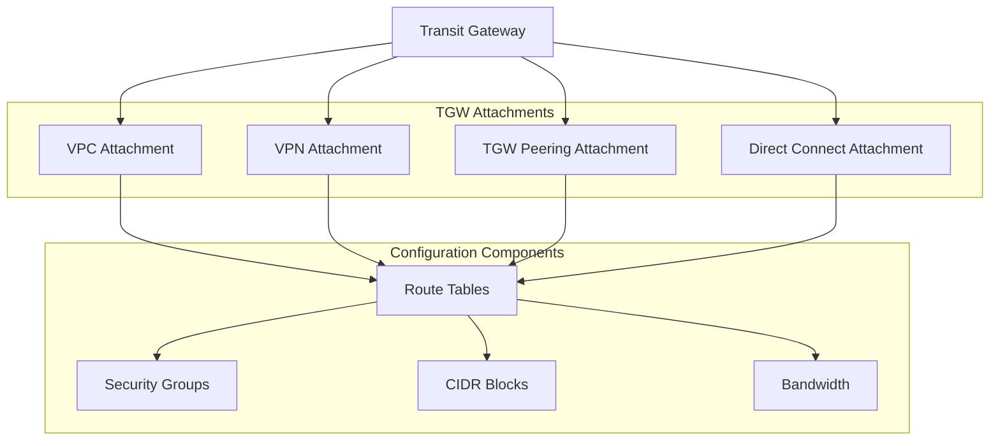
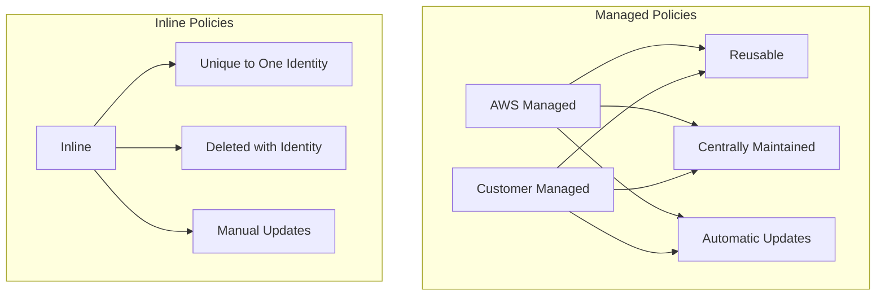

# 1. There are two VPCs, and I want to privately communicate with one EC2 from another VPC?

#### Here are the key methods to establish private communication between EC2 instances in different VPCs:
1. Create VPC peering connection between VPCs
2. Accept peering connection in destination VPC
3. Update route tables in both VPCs to route traffic through peering connection
4. Configure security groups to allow required traffic

**Alternative solutions:**
- Transit Gateway (for connecting multiple VPCs)
- VPN Connection (if VPCs are in different regions)
- PrivateLink (for specific service access)

---
# 2. What is the Transit Gateway attachment? What is that configuration in the attachment?
### Key Points: AWS Transit Gateway Attachments

AWS Transit Gateway attachments are connection points that link different network resources to AWS Transit Gateway. Key configurations and considerations are detailed below:

---

## **1. Route Tables**

### **Association with Specific Route Tables**
- Attachments must be associated with one or more route tables within the Transit Gateway.
- Determines the routing rules that apply to traffic passing through the attachment.

### **Propagation Settings**
- Allows the routes from attachments to propagate to associated route tables.
- Ensures dynamic updates to routing as new connections are made.

### **Static/Dynamic Route Definitions**
- Static routes can be defined for predictable traffic patterns.
- Dynamic routes leverage BGP (Border Gateway Protocol) for automated updates.

---

## **2. Security**

### **Security Group Rules**
- Enforce inbound and outbound traffic rules for associated resources.
- Define IP ranges, ports, and protocols to allow or block traffic.

### **Network ACLs**
- Layered security controls at the subnet level.
- Add an additional layer of protection beyond security groups.

### **Subnet Associations**
- Subnets linked to attachments must align with Transit Gateway security requirements.
- Ensure proper alignment with routing and access control rules.

---

## **3. Network Settings**

### **CIDR Block Configurations**
- Specify the IP address ranges for associated networks.
- Avoid overlaps to prevent routing conflicts.

### **DNS Support/Hostname Settings**
- Enable DNS support to resolve domain names to IPs.
- Useful for hybrid deployments requiring name resolution.

### **IPv4/IPv6 Settings**
- Support dual-stack deployments for IPv4 and IPv6.
- Configure addresses as per application and compliance needs.

---

## **4. Bandwidth**

### **Throughput Capacity**
- Defined by the Transit Gateway attachment type.
- Ensure adequate capacity for high-traffic environments.

### **Bandwidth Allocation**
- Allocate bandwidth based on traffic demands.
- Monitor and adjust allocations as needed.

### **Quality of Service (QoS) Settings**
- Implement QoS policies for traffic prioritization.
- Ensure critical applications receive sufficient bandwidth.

---

This summary highlights the essential configurations and considerations for AWS Transit Gateway attachments. Proper planning and adherence to these guidelines ensure efficient and secure network connectivity.

Let me know if you need further elaboration or edits!

---

# 3. What are the Inline Policy and Managed Policy?

#### Key Differences Between Managed and Inline Policies

---

## **1. Managed Policies**

- **Definition**: Standalone policies attachable to multiple users, roles, or groups.
- **Types**:
  - AWS-managed: Created and maintained by AWS.
  - Customer-managed: Created and managed by you.
- **Features**:
  - Version-controlled for tracking updates.
  - Reusable across multiple accounts and identities.

## **2. Inline Policies**

- **Definition**: Policies embedded directly in a single user, role, or group.
- **Features**:
  - One-to-one relationship with the attached identity.
  - Cannot be shared or reused.
  - Automatically deleted when the associated identity is deleted.

## **Best Practices**

1. **Use Managed Policies for Common Permissions**
   - Apply to multiple identities to enforce consistent permissions.

2. **Use Inline Policies for Unique, One-Off Permissions**
   - Ideal for defining specific, one-time access needs.

3. **Leverage AWS-Managed Policies for Service-Specific Access**
   - Simplify permissions for common use cases with AWS-provided policies.

---

