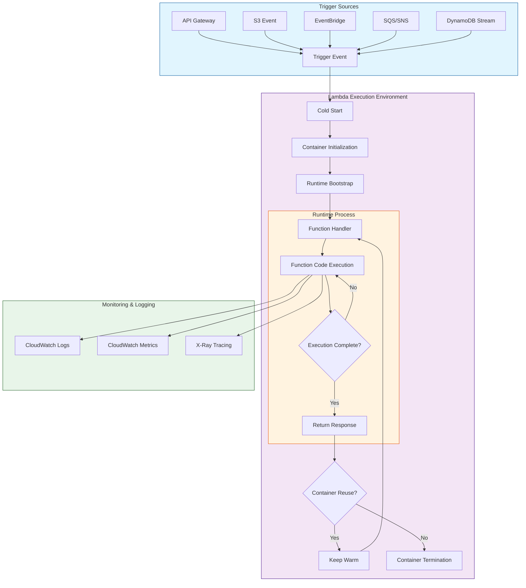

# AWS Lambda Overview
- AWS Lambda is a serverless computing service that allows you to run code without provisioning or managing servers.
- It automatically scales and executes your code in response to triggers from other AWS services or HTTP requests, and you pay only for the compute time consumed.
---
## Key Features of AWS Lambda
**1. Event-Driven Execution**
- Lambda functions are triggered by events from AWS services like S3, DynamoDB, API Gateway, SNS, or external sources.

**2. No Server Management**
- AWS manages all the underlying infrastructure, including scaling, patching, and maintenance.

**3. Auto Scaling**
- Lambda automatically scales based on the number of incoming requests.

**4. Pay-per-Use**
- Billed only for the execution time and memory consumed per request.

**5. Supports Multiple Languages**
- Supports Python, Node.js, Java, Go, .NET, Ruby, and PowerShell.

**6. Secure Execution**
- Runs in a sandboxed environment with IAM roles for access control.

## How AWS Lambda Works

## Let me explain each phase of the Lambda execution flow:

**1. Trigger Sources:**
- API Gateway: HTTP/REST API requests
- S3 Events: File uploads/deletions
- EventBridge: Scheduled or event-based triggers
- SQS/SNS: Message-based triggers
- DynamoDB Streams: Database changes

    
**2. Cold Start Phase:**
- Container Initialization: AWS prepares a new container
- Runtime Bootstrap: Sets up the runtime environment
- Function Handler: Entry point preparation
    
**3. Runtime Process:**
- Function Code Execution: Your actual code runs
- Execution Loop: Processes until completion
- Response Return: Sends back results

**4. Container Management:**
- Container Reuse: Keeps warm for subsequent invocations
- Container Termination: Cleanup if not reused

**5. Monitoring & Logging:**
- CloudWatch Logs: Function logs
- CloudWatch Metrics: Performance metrics
- X-Ray Tracing: Distributed tracing

## Limitations of AWS Lambda
- Execution Timeout – Max 15 minutes per function execution.
- Memory Limits – 128 MB to 10 GB per function.
- Cold Start Delays – Initial execution may have latency.
- Limited Storage – 512 MB of temporary storage (/tmp directory).
- Concurrency Limits – Default 1000 concurrent executions (can be increased).
